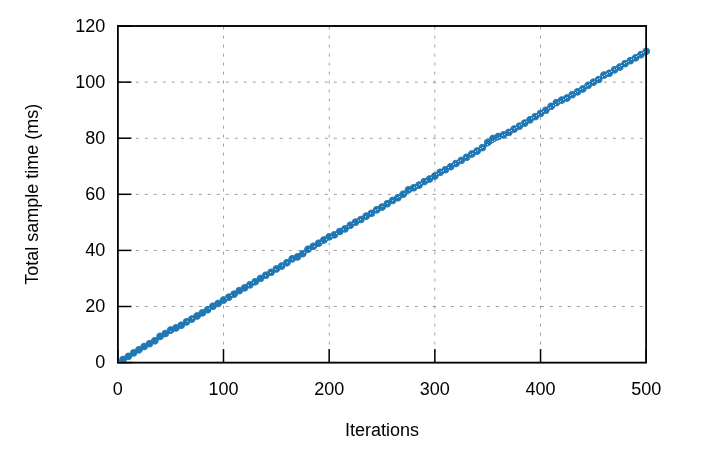
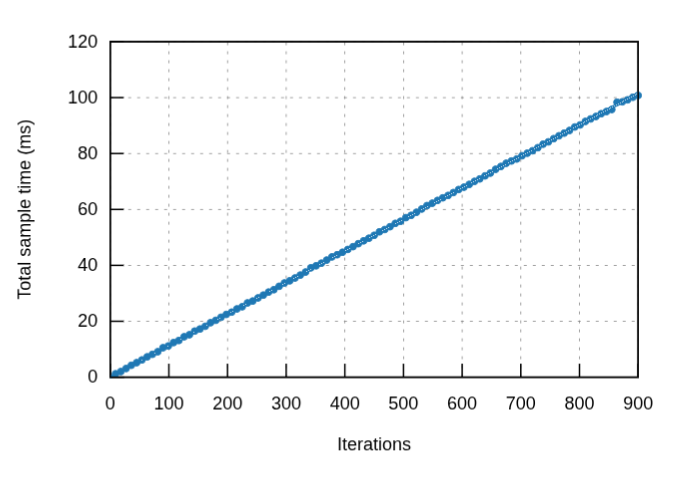
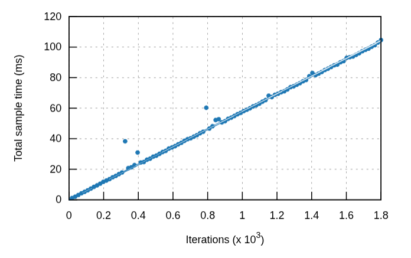
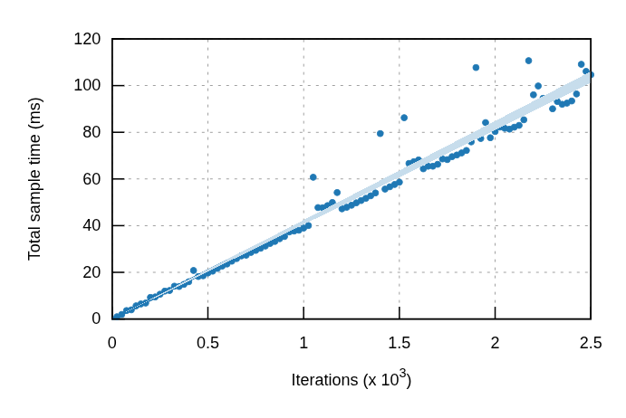
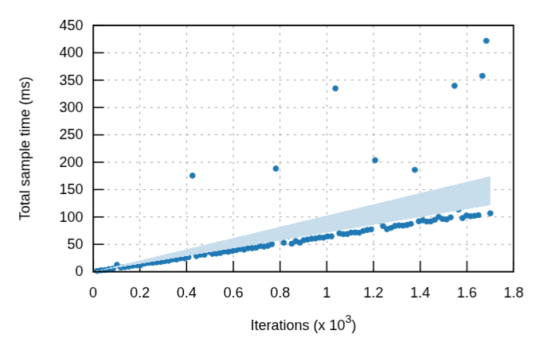

# spill-ring

A fixed-capacity ring buffer that spills evicted items to a configurable spout on overflow.

## Why Spill-Ring

Bounded buffers usually force a choice: block when full, drop new items, or drop old items. Spill-Ring evicts the oldest item to a *spout* rather than silently dropping it. This preserves all data while maintaining bounded memory. If no spout is configured, evicted items are dropped as expected.

## Ring Types

| Type | Description | Requires |
|------|-------------|----------|
| `SpillRing<T, N, S>` | Single-threaded ring buffer using `Cell`-based indices | — |
| `MpscRing<T, N, S>` | Zero-contention MPSC — each producer owns an independent `SpillRing` | `alloc` |
| `WorkerPool<T, N, S, F, A>` | Persistent thread pool with pre-warmed rings and spin-barrier sync | `std` |

## Ring Chaining

`SpillRing` implements `Spout<T>`, so a ring can be used as another ring's overflow sink. Overflow from one ring flows into the next, creating tiered buffers. On drop, remaining items flush through the chain.

## no_std Support

| | no_std (no alloc) | alloc | std |
|---|---|---|---|
| `SpillRing` | yes | yes | yes |
| `MpscRing` / `Producer` / `Consumer` | — | yes | yes |
| `WorkerPool` / `PoolBuilder` | — | — | yes |

## Usage

**Note:** This library is not on crates.io yet. Please use the repository version until it is published.

```toml
[dependencies]
spill-ring = { git = "https://github.com/abmac-io/abmac-lib" }
```

```rust
use spill_ring::SpillRing;

let mut ring: SpillRing<i32, 4> = SpillRing::new();

ring.push(1);
ring.push(2);
ring.push(3);
ring.push(4); // full

ring.push(5); // evicts 1, buffer contains [2, 3, 4, 5]

assert_eq!(ring.pop(), Some(2));
```

## Examples

| Example | Description |
|---------|-------------|
| [spill_ring](examples/spill_ring.rs) | Basic ring with `CollectSpout`, eviction, iteration, flush |
| [mpsc](examples/mpsc.rs) | Multiple producers with consumer draining |
| [backpressure](examples/backpressure.rs) | Lossless delivery with `SyncChannelSpout` backpressure |

## Feature Flags

| Feature   | Description |
|-----------|-------------|
| `std`     | Enables `WorkerPool`, `PoolBuilder` (implies `spout/std`) |
| `verdict` | Adds `Actionable` impl on `PushError` — classifies `Full` as `Temporary` (retryable) |

## Capacity Constraints

- Must be a power of 2 (enables fast bitwise modulo)
- Must be > 0
- Maximum: 1,048,576 slots

## Performance

| Ring | Access | Throughput | Notes |
|------|--------|------------|-------|
| SpillRing | `&self` | ~1.8 Gelem/s | Interior mutability via Cell, used by ring chaining |
| SpillRing | `&mut self` | ~1.4 Gelem/s | Exclusive access, no Cell overhead |
| VecDeque (manual eviction) | — | ~758 Melem/s | stdlib baseline for comparison |

**WorkerPool scaling** (AMD Ryzen 9 7950X, 8 cores):

| Workers | Aggregate | Per-worker |
|---------|-----------|------------|
| 1 | 1.8 Gelem/s | 1.80 Gelem/s |
| 2 | 3.5 Gelem/s | 1.77 Gelem/s |
| 4 | 7.0 Gelem/s | 1.74 Gelem/s |
| 6 | 10.3 Gelem/s | 1.71 Gelem/s |
| 8 | 6.5 Gelem/s | 0.81 Gelem/s |

Scales linearly up to N-2 cores. At full core count (8 workers on 8 cores), the spin-barrier, benchmark harness, and OS scheduler all compete for cycles with no free cores to absorb the overhead. This halves per-worker throughput. Leave at least 2 cores free for best results.

| 1 worker | 2 workers | 4 workers |
|:---:|:---:|:---:|
|  |  |  |
| **6 workers** | **8 workers (saturated)** | |
|  |  | |

Power-of-two capacity enables fast bitwise modulo. All rings are cache-warmed by default.

**With `std`**, WorkerPool adds persistent threads with pre-warmed rings (no `thread::spawn` per run) and spin-barrier sync.

Run benchmarks locally: `cargo bench -p spill-ring --features std`

## License

Licensed under either of [Apache License, Version 2.0](LICENSE-APACHE) or [MIT license](LICENSE-MIT) at your option.
